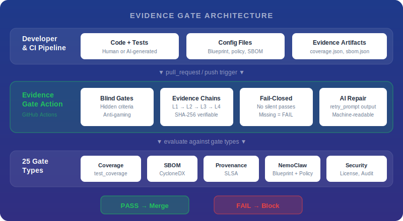

[English](README.md) | **日本語**

# Evidence Gate Action

GitHub Actions 向けのフェイルクローズド品質ゲート。検証可能なエビデンスチェーンを備えています。

**AI がコードもテストも書く時代。品質を監査人にどう証明しますか？** Evidence Gate はパイプラインの成果物を品質基準に照らして評価し、基準を満たさないマージをブロックし、すべての評価を改ざん防止のエビデンスとして記録します（L1 宣言から L4 SHA-256 ハッシュチェーンまで）。**Blind Gates** は合否基準を秘匿するため、AI エージェントが基準をリバースエンジニアリングしたり、不正に攻略したりすることを困難にします。

これは CI/CD 品質ゲートの強制ツールです。AI コードレビューツールでも、AI エージェントのガードレールでもありません。GitHub 上には「Evidence Gate」という名前を共有する無関係のプロジェクトが複数存在しますが、本プロジェクトは CI/CD パイプラインにおける品質を強制するものです。

[](https://github.com/marketplace/actions/evidence-gate-action)
[](LICENSE)

## クイックスタート

任意の GitHub Actions ワークフローに以下のステップを追加してください：

```yaml
- uses: evidence-gate/evidence-gate-action@v1
  with:
    gate_type: "test_coverage"
    phase_id: "testing"
    evidence_files: "coverage.json"
```

エビデンスが有効であればステップは成功します。エビデンスが欠落または無効であればステップは失敗します。サイレントパスは発生しません。

## 必要なもの

| | Free | Pro / Enterprise |
|---|---|---|
| **API キー** | 不要 | `api_key: ${{ secrets.EVIDENCE_GATE_API_KEY }}` |
| **実行内容** | ローカル検証（ファイル存在確認、JSON スキーマ、数値しきい値） | ホスト型評価（Blind Gates、エビデンスチェーン (L4)、品質状態） |
| **月間評価回数** | 100 | 5,000+ |
| **最適な用途** | オープンソースプロジェクト、基本的なエビデンスチェック | 監査証跡、コンプライアンスワークフロー、AI 駆動パイプラインを必要とするチーム |

Enterprise は同じアクションにカスタム `api_base` を指定することで、セルフホスト環境にデプロイできます。

## 利用シーン

- **AI 支援開発** -- LLM がコードとテストの両方を生成する場合、従来のカバレッジ指標は何も証明しません。Blind Gates はこの問題に対する構造的なアプローチです
- **監査とコンプライアンス** -- すべての品質ゲート判定の検証可能な記録を保持します（SOC 2、ISO 27001、EU AI Act、日本の AI ガイドライン）
- **デプロイメントゲーティング** -- 品質エビデンスが存在し有効でない限り、デプロイをブロックします
- **マルチゲートパイプライン** -- 単一のアクションでカバレッジ、セキュリティ、ビルドのゲートを順次実行します

## パーミッション

| 機能 | `contents` | `checks` | `id-token` | `pull-requests` |
|------|:----------:|:--------:|:----------:|:---------------:|
| 基本的なゲート評価 | `read` | -- | -- | -- |
| Check Run アノテーション | `read` | `write` | -- | -- |
| OIDC キーレス認証 (Pro) | `read` | -- | `write` | -- |
| PR スティッキーコメント | `read` | -- | -- | `write` |

Check Run をサポートする一般的なワークフロー：

```yaml
jobs:
  gate:
    runs-on: ubuntu-latest
    permissions:
      contents: read
      checks: write
    steps:
      - uses: evidence-gate/evidence-gate-action@v1
        with:
          gate_type: "test_coverage"
          phase_id: "testing"
          evidence_files: "coverage.json"
```

## 入力

| 入力 | 必須 | デフォルト | 説明 |
|------|:----:|-----------|------|
| `gate_type` | いいえ | `""` | 評価するゲートタイプ（例: `test_coverage`、`security`、`build`、`skill`）。`.evidencegate.yml` がある場合は省略可能 |
| `phase_id` | いいえ | `""` | フェーズ識別子（例: `build`、`test`、`deploy`）。`.evidencegate.yml` がある場合は省略可能 |
| `evidence_files` | いいえ | `""` | エビデンスファイルパスのカンマ区切りリスト |
| `api_key` | いいえ | `""` | Evidence Gate API キー。Free モードでは省略 |
| `api_base` | いいえ | `https://api.evidence-gate.dev` | API ベース URL。セルフホスト Enterprise の場合に変更 |
| `mode` | いいえ | `enforce` | `enforce`（ゲート失敗時にステップを失敗させる）または `observe`（結果をログに記録するがブロックしない） |
| `gate_preset` | いいえ | `""` | 名前付きゲートバンドル（`web-app-baseline`、`enterprise-compliance`、`api-service`、`supply-chain`）。プリセット内のすべてのゲートを実行 |
| `sticky_comment` | いいえ | `false` | 結果を単一の自動更新 PR コメントに集約。`pull-requests: write` が必要 |
| `debug` | いいえ | `false` | 詳細な診断出力を有効化 |
| `version` | いいえ | `latest` | インストールする評価エンジンのバージョン（例: `1.0.0`）。`latest` は標準ライブラリのみの評価を使用 |
| `dashboard_base_url` | いいえ | `""` | ダッシュボードのディープリンク用ベース URL |
| `evidence_url` | いいえ | `""` | 明示的なエビデンスディープリンク URL |

## 出力

| 出力 | 説明 |
|------|------|
| `passed` | ゲート結果: `true` または `false` |
| `mode` | 検出されたモード: `free`、`pro`、または `enterprise` |
| `run_id` | パイプラン実行 ID |
| `major_issue_count` | 検出された問題の数 |
| `observe_would_pass` | observe モードにおいて、ゲートが通過したかどうか。`mode: observe` の場合のみ設定 |
| `missing_evidence` | 欠落しているエビデンス項目の JSON 配列 `[{code, message, field_path}]` |
| `suggested_actions` | 失敗したゲートに対する人間が読める修復手順 |
| `retry_prompt` | AI エージェント向けの機械可読な修復指示。ゲート通過時は空文字列 |
| `json_output` | 完全な評価結果の JSON（`fromJson()` でパース） |
| `trace_url` | トレース URL (Pro/Enterprise) |
| `evidence_url` | エビデンス詳細 URL |
| `dashboard_url` | ダッシュボード URL |
| `github_run_url` | GitHub Actions 実行 URL |

## 後続ステップでのゲート結果の利用

```yaml
- name: Evidence Gate
  id: gate
  uses: evidence-gate/evidence-gate-action@v1
  with:
    gate_type: "test_coverage"
    phase_id: "testing"
    evidence_files: "coverage.json"

- name: Handle failure
  if: failure()
  run: |
    echo "Missing: ${{ steps.gate.outputs.missing_evidence }}"
    echo "Fix: ${{ steps.gate.outputs.suggested_actions }}"

- name: Deploy (only if gate passed)
  if: steps.gate.outputs.passed == 'true'
  run: ./deploy.sh
```

## ソリューション

そのままコピー＆ペーストで使えるワークフローファイルです。各レシピには必要な `permissions` ブロックが含まれています。

### すべての PR でテストカバレッジを強制する

API キー不要。テストスイートがカバレッジエビデンスを生成したことを検証します：

```yaml
name: Test Coverage Gate
on: [pull_request]

jobs:
  coverage-gate:
    runs-on: ubuntu-latest
    permissions:
      contents: read
      checks: write
    steps:
      - uses: actions/checkout@v4

      - name: Run tests with coverage
        run: pytest --cov --cov-report=json

      - name: Evidence Gate
        uses: evidence-gate/evidence-gate-action@v1
        with:
          gate_type: "test_coverage"
          phase_id: "testing"
          evidence_files: "coverage.json"
```

### セキュリティスキャンなしの PR をブロックする

```yaml
name: Security Gate
on: [pull_request]

jobs:
  security-gate:
    runs-on: ubuntu-latest
    permissions:
      contents: read
      checks: write
    steps:
      - uses: actions/checkout@v4

      - name: Run security scan
        run: bandit -r src/ -f json -o security-report.json || true

      - name: Evidence Gate
        uses: evidence-gate/evidence-gate-action@v1
        with:
          gate_type: "security"
          phase_id: "security-scan"
          evidence_files: "security-report.json"
```

### デプロイ前にビルド成果物を必須にする

```yaml
name: Build Gate
on: [push]

jobs:
  build-gate:
    runs-on: ubuntu-latest
    permissions:
      contents: read
      checks: write
    steps:
      - uses: actions/checkout@v4

      - name: Build
        run: npm run build

      - name: Evidence Gate
        uses: evidence-gate/evidence-gate-action@v1
        with:
          gate_type: "build"
          phase_id: "build"
          evidence_files: "dist/index.js,dist/index.css"
```

### 複数の品質チェックを順次実行する

```yaml
name: Multi-Gate Pipeline
on: [pull_request]

jobs:
  quality-gates:
    runs-on: ubuntu-latest
    permissions:
      contents: read
      checks: write
    steps:
      - uses: actions/checkout@v4

      - name: Run tests
        run: pytest --cov --cov-report=json

      - name: Run security scan
        run: bandit -r src/ -f json -o security-report.json || true

      - name: Coverage Gate
        uses: evidence-gate/evidence-gate-action@v1
        with:
          gate_type: "test_coverage"
          phase_id: "testing"
          evidence_files: "coverage.json"

      - name: Security Gate
        uses: evidence-gate/evidence-gate-action@v1
        with:
          gate_type: "security"
          phase_id: "security"
          evidence_files: "security-report.json"
```

### キュレート済みゲートバンドルを使用する（選択に迷わない）

単一の入力でキュレート済みのゲートバンドルを実行します。4つのプリセットが利用可能です: `web-app-baseline`、`enterprise-compliance`、`api-service`、`supply-chain`。

```yaml
name: Preset Gate
on: [pull_request]

jobs:
  preset-gate:
    runs-on: ubuntu-latest
    permissions:
      contents: read
      checks: write
    steps:
      - uses: actions/checkout@v4

      - name: Run tests
        run: pytest --cov --cov-report=json

      - name: Evidence Gate (Web App Baseline)
        uses: evidence-gate/evidence-gate-action@v1
        with:
          gate_preset: "web-app-baseline"
          phase_id: "quality-check"
          evidence_files: "coverage.json,security-report.json"
```

### 強制前にゲート通過率を測定する

ワークフローを失敗させずにすべてのゲートを評価します。強制前にゲート通過率を測定するために使用します：

```yaml
name: Observe Mode
on: [pull_request]

jobs:
  observe:
    runs-on: ubuntu-latest
    permissions:
      contents: read
      checks: write
    steps:
      - uses: actions/checkout@v4

      - name: Run tests
        run: pytest --cov --cov-report=json

      - name: Evidence Gate (Observe)
        id: gate
        uses: evidence-gate/evidence-gate-action@v1
        with:
          gate_type: "test_coverage"
          phase_id: "testing"
          evidence_files: "coverage.json"
          mode: "observe"

      - name: Check results
        run: echo "Would have passed: ${{ steps.gate.outputs.observe_would_pass }}"
```

### AI エージェントによる品質指標の不正操作を防止する

Blind Gates は評価基準をパイプラインの外部に保持するため、コードを生成した AI はしきい値を見ることも不正に攻略することもできません。`skill` ゲートタイプは、隠された基準によるスキル評価が主要なユースケースであるためここで使用されています：

```yaml
name: Blind Gate Evaluation
on: [pull_request]

jobs:
  blind-gate:
    runs-on: ubuntu-latest
    permissions:
      contents: read
      checks: write
      id-token: write
    steps:
      - uses: actions/checkout@v4

      - name: Run tests
        run: pytest --cov --cov-report=json

      - name: Evidence Gate (Blind)
        uses: evidence-gate/evidence-gate-action@v1
        with:
          gate_type: "skill"
          phase_id: "quality-check"
          evidence_files: "coverage.json"
          api_key: ${{ secrets.EVIDENCE_GATE_API_KEY }}
```

### すべてのゲート結果を1つの PR コメントに集約する

複数のゲート結果を、自動更新される単一の PR コメントに集約します：

```yaml
name: Quality Gates with Sticky Comment
on: [pull_request]

jobs:
  gates:
    runs-on: ubuntu-latest
    permissions:
      contents: read
      checks: write
      pull-requests: write
    steps:
      - uses: actions/checkout@v4

      - name: Run tests
        run: pytest --cov --cov-report=json

      - name: Coverage Gate
        uses: evidence-gate/evidence-gate-action@v1
        with:
          gate_type: "test_coverage"
          phase_id: "testing"
          evidence_files: "coverage.json"
          sticky_comment: "true"

      - name: Build Gate
        uses: evidence-gate/evidence-gate-action@v1
        with:
          gate_type: "build"
          phase_id: "build"
          evidence_files: "dist/index.js"
          sticky_comment: "true"
```

### リポジトリファイルから設定する（ワークフロー入力不要）

リポジトリルートに `.evidencegate.yml` を追加し、入力なしでアクションを実行します：

```yaml
# .evidencegate.yml
gate_type: test_coverage
phase_id: testing
mode: enforce
evidence_files:
  - coverage.json
```

```yaml
# .github/workflows/gate.yml — 入力不要
name: Evidence Gate
on: [pull_request]
jobs:
  gate:
    runs-on: ubuntu-latest
    permissions:
      contents: read
      checks: write
    steps:
      - uses: actions/checkout@v4
      - run: pytest --cov --cov-report=json
      - uses: evidence-gate/evidence-gate-action@v1
```

### SBOM とビルド来歴を検証する

リリースパイプラインの一部として、サプライチェーンセキュリティの成果物を検証します：

```yaml
name: Supply Chain Gate
on: [push]
jobs:
  supply-chain:
    runs-on: ubuntu-latest
    permissions:
      contents: read
      checks: write
    steps:
      - uses: actions/checkout@v4
      - uses: evidence-gate/evidence-gate-action@v1
        with:
          gate_type: "sbom"
          phase_id: "release"
          evidence_files: "sbom.cdx.json"
```

ビルド来歴の証明には `gate_type: "provenance"` を使用します。いずれのゲートタイプも Free モードで利用可能です。

## 視覚的な確認

<!-- TODO: ライブの GitHub Actions 環境でアクションが実行されたらスクリーンショットに差し替え -->

### Check Run アノテーション

ゲートが失敗すると、PR の **Files Changed** タブにインラインで結果が表示されます：

```
::error file=src/app.py,line=1::test_coverage gate FAILED — coverage 72% < threshold 80%
::warning file=coverage.json::Evidence file found but threshold not met
::notice ::Suggested action: increase test coverage by 8 percentage points
```

アノテーションは GitHub を離れることなく確認できます。`::error` はブロッキングレビューを作成し、`::warning` はファイルにフラグを付け、`::notice` はコンテキストを追加します。

<!-- TODO: スクリーンショットに差し替え -->

### ジョブサマリー

各実行は `GITHUB_STEP_SUMMARY` に構造化されたサマリーを追記します（Actions UI の Summary タブで確認可能）：

| シグナル | ゲート | 結果 | 詳細 |
|----------|--------|------|------|
| CRITICAL | test_coverage | FAILED | coverage 72% < 80% threshold |
| WARNING | security | WARN | 2 medium-severity findings |
| INFO | build | PASSED | dist/index.js present (124 KB) |

結果はシグナルの階層順にソートされます: Critical > Warning > Info。ログを掘り返さずに失敗をトリアージするためにこのビューを使用してください。

## v1.0.x から v1.1.0 への移行

v1.1.0 はほとんどのユーザーにとって**後方互換**です。既存のワークフローは変更なしで動作し続けます。

### 唯一の破壊的変更: API ベース URL

セルフホスト Enterprise でカスタム `api_base` を使用している場合、対応は不要です。カスタム URL がデフォルトを上書きします。

以前の**デフォルト URL** `https://api.evidence-gate.com` に依存していた場合、`https://api.evidence-gate.dev` に変更されました。Free および Pro ユーザーは影響を受けません。デフォルト URL の変更は自動的に適用されます。

### 変更前 / 変更後

**変更前 (v1.0.x) -- v1.1.0 でもそのまま動作：**

```yaml
- uses: evidence-gate/evidence-gate-action@v1
  with:
    gate_type: "test_coverage"   # 以前は必須。設定ファイルがあれば省略可能に
    phase_id: "testing"          # 以前は必須。設定ファイルがあれば省略可能に
    evidence_files: "coverage.json"
```

**変更後 (v1.1.0) 設定ファイル使用（任意のアップグレード）：**

```yaml
# リポジトリルートの .evidencegate.yml
gate_type: test_coverage
phase_id: testing
evidence_files:
  - coverage.json

# ワークフロー — 入力不要
- uses: evidence-gate/evidence-gate-action@v1
```

### v1.1.0 の新機能

| 機能 | 使い方 | 備考 |
|------|--------|------|
| 設定ファイル | `.evidencegate.yml` を追加 | 必須入力なし |
| Warn モード | `mode: warn` | ゲートは失敗するがステップは成功 |
| Observe モード | `mode: observe` | シャドウ実行 -- `observe_would_pass` を出力 |
| ゲートプリセット | `gate_preset: web-app-baseline` | 4つのゲートを一括実行 |
| PR スティッキーコメント | `sticky_comment: true` | 単一の自動更新コメント |
| AI 修復コントラクト | 出力 `retry_prompt` | AI エージェント向けの機械可読な修復指示 |
| SBOM ゲート | `gate_type: sbom` | CycloneDX/SPDX 検証 (Free) |
| Provenance ゲート | `gate_type: provenance` | ビルド証明チェック (Free) |
| Check Run アノテーション | 自動 | Files Changed タブにインライン表示 |
| シグナルソート済みジョブサマリー | 自動 | Critical > Warning > Info |

### 移行チェックリスト

- [ ] 既存のワークフローが引き続きパスすることを確認（ほとんどのユーザー: 対応不要）
- [ ] セルフホスト Enterprise を使用している場合: `api_base` URL が正しいことを確認
- [ ] 任意: 入力なしで使用するためにリポジトリに `.evidencegate.yml` を追加
- [ ] 任意: 段階的なロールアウトのために重要でないゲートに `mode: warn` を追加
- [ ] 任意: PR フィードバックを集約するために `sticky_comment: true` を追加

## アーキテクチャ

<p align="center">
  
</p>

## このプロジェクトが存在する理由

AI エージェント（Copilot、Claude、Cursor）が本番コードとテストの両方を生成する場合、従来の CI/CD ゲートはその意味を失います。「80% のカバレッジを達成せよ」と指示された LLM は、ちょうど 80.1% に到達するテストを生成します。これは指標を満たす数値ですが、品質について何も証明しません。

Evidence Gate はこの問題に対して3つの設計方針で対処します：

1. **Blind Gates** -- 評価基準がパイプラインから隠されるため、AI エージェントが基準をリバースエンジニアリングしたり最適化したりすることを困難にします。これは AI 駆動開発におけるゲート不正攻略の問題に対する構造的なアプローチです。

2. **エビデンス信頼レベル** -- すべての評価は4つの信頼レベルのいずれかで記録されます：
   - **L1** 宣言 -- パイプラインが何かが発生したと主張する
   - **L2** 証明 -- 第三者がその主張を確認する
   - **L3** 検証 -- その主張が独立して再現可能である
   - **L4** ハッシュチェーン -- 任意の監査人が独立して検証可能な SHA-256 チェーン

3. **フェイルクローズドセマンティクス** -- エビデンスの欠落、API への到達不能、評価エラーは FAIL を意味し、サイレントパスは決して発生しません。

エビデンスモデルは、グローバルな規制フレームワーク -- SOC 2、ISO 27001、EU AI Act の透明性要件、日本の AI ガイドライン、および AI 生成コードがどのように検証されたかの検証可能な記録をますます要求する同様の基準 -- を念頭に設計されています。Evidence Gate はまだすべてのフレームワークのすべての要件を網羅しているわけではなく、規制も進化し続けています。しかし、コアアーキテクチャ -- 不変のエビデンスチェーン、独立した検証可能性、フェイルクローズドセマンティクス -- はこれらの基準とともに成長するように構築されています。

これはアクティブに開発中のオープンソースプロジェクトです。フィードバック、コントリビュート、実際のユースケースを歓迎します。

## モード

| モード | 設定 | 動作 |
|--------|------|------|
| **Free** | `api_key` なし | クライアントサイド評価: ファイル存在確認、JSON 検証、スキーマチェック、数値しきい値 |
| **Pro** | `api_key` を設定 | フル SaaS 評価: Blind Gate、品質状態、エビデンスチェーン (L4)、修復 |
| **Enterprise** | `api_key` + カスタム `api_base` | 自社インフラでの Pro と同等のセルフホスト |

## Free vs Pro

| 機能 | Free | Pro / Enterprise |
|------|:----:|:----------------:|
| 月間ゲート評価回数 | 100 | 5,000+ |
| 全25ゲートタイプ | はい | はい |
| SARIF 出力 | はい | はい |
| GitHub Check Runs | はい | はい |
| SHA-256 整合性ハッシュ | はい | はい |
| フェイルクローズドエラーハンドリング | はい | はい |
| `GITHUB_STEP_SUMMARY` | はい | はい |
| Observe モード | はい | はい |
| ゲートプリセット | はい | はい |
| PR スティッキーコメント | はい | はい |
| 構造化出力 (missing_evidence, suggested_actions) | はい | はい |
| Blind Gate 評価 | -- | はい |
| エビデンスチェーン検証 (L4) | -- | はい |
| 品質状態トラッキング | -- | はい |
| 修復ワークフロー | -- | はい |

## トラブルシューティング

### 「Gate type requires Pro plan」の警告

Pro 限定のゲートタイプを `api_key` なしで使用しています。API キーを追加してください：

```yaml
api_key: ${{ secrets.EVIDENCE_GATE_API_KEY }}
```

### エビデンスファイルが見つからない

- **相対パス**: パスは `$GITHUB_WORKSPACE` から解決されます。`/home/runner/work/.../coverage.json` ではなく `coverage.json` を使用してください。
- **ビルドステップの欠落**: テスト/ビルドステップが Evidence Gate ステップの**前に**実行されていることを確認してください。
- **Glob 非対応**: 各ファイルをカンマ区切りで明示的にリストしてください。

### API 接続エラー (Pro/Enterprise)

1. **API キーの確認**: リポジトリの Secrets に `EVIDENCE_GATE_API_KEY` が設定されていることを確認してください。
2. **API ベース URL の確認**: Enterprise の場合、GitHub Actions ランナーから `api_base` に到達可能であることを確認してください。

このアクションは**フェイルクローズド**セマンティクスを使用します。未処理のエラーはすべて非ゼロで終了します。これにより、評価サービスに到達できない場合の偽パスを防止します。

## リンク

- [ランディングページと料金](https://evidence-gate.dev)
- [ドキュメント](https://evidence-gate.dev/docs/)
- [変更履歴](CHANGELOG.md)

## ライセンス

Apache License 2.0。詳細は [LICENSE](LICENSE) を参照してください。
